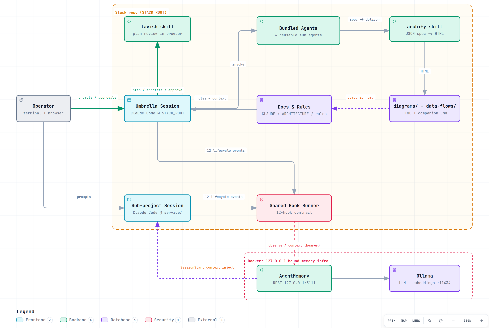

# Microservices + Claude Code + AgentMemory Boilerplate

[](https://github.com/evgeniyKazak/claude-kit/actions/workflows/ci.yml)

A drop-in setup for running a **microservices product the way this stack runs it**: every
service is its own Claude Code project, all of them share a persistent memory layer
(AgentMemory) wired through lifecycle hooks, and a strict umbrella ⇄ sub-project architecture
keeps context, rules, and decisions in predictable places.

It is **documentation + templates**, not an installer. The work of standing it up is driven by
[`SETUP.md`](SETUP.md) — a prescriptive guide you (or Claude Code itself) follow once.

## What you get

- **AgentMemory infra** — `ollama` + `agentmemory` docker services, a tuned `agentmemory.env`
  profile (local embeddings + local LLM compress), and a path-independent shared hook runner.
- **The 12-hook contract** — every Claude session captures tool-uses/prompts automatically and
  starts with `<architecture-context>` + `<parent-project-context>` injected.
- **Strict umbrella/sub-project architecture** — a curated `.claude/rules/` set, an ADR system,
  and a sub-project standard that every service follows identically.
- **Reusable agents** — a cross-service `flow-explainer`, a single-service `flow-explainer`, and
  a stack-agnostic `code-reviewer` — all wired to visualize architecture, API contracts, and DB
  relations with **archify** (interactive HTML diagrams in `diagrams/`, a companion `.md` per schema).
- **A workflow mandate** — lavish-plan-first (plans are visual HTML artifacts reviewed and approved
  in the browser via **lavish**), verification-before-done, baked into the rules.
- **Two umbrella skills** — [`tt-a1i/archify`](https://github.com/tt-a1i/archify) and
  [`kunchenguid/lavish-axi`](https://github.com/kunchenguid/lavish-axi), installed at setup time via
  `npx skills add` (never vendored).

## Architecture



The PNG is rendered by CI from the archify spec on every push (no manual export). Interactive
version (search, route tracing, dark/light, PNG/SVG export): open
[`docs/boilerplate-architecture.html`](docs/boilerplate-architecture.html) in a browser — or review it
with `npx -y lavish-axi docs/boilerplate-architecture.html`.

## Layout

```
SETUP.md                       # ← start here: the step-by-step setup guide
UPDATE.md                      # upgrade an already-installed stack to the current boilerplate
CHANGELOG.md                   # kit versions + per-release Migration sections
scripts/                       # kit-doctor.sh (conformance), CI lint/render helpers
docs/                          # boilerplate architecture diagram (archify HTML + CI-rendered PNG)
templates/
├── infra/                     # ollama + agentmemory docker services, env examples
├── umbrella/                  # the stack-root .claude/ + CLAUDE/ARCHITECTURE/CHANGELOG/BACKLOG
│   └── .claude/{shared-hooks,rules,adr,agents,settings*}
└── subproject/                # the per-service skeleton (copied once per service)
    └── .claude/{hooks,rules,agents,settings.local.json}
```

## Quick start

1. Read [`SETUP.md`](SETUP.md) — **Step 1 (platform detection) matters**: the infra defaults to an
   NVIDIA-on-Linux example, and the right LLM runtime differs on CPU-only and Apple Silicon hosts.
2. Copy `templates/infra/*` into your stack, generate a bearer, bring up `ollama` + `agentmemory`.
3. Copy `templates/umbrella/.claude/` to your stack root; fill `CLAUDE.md` + `ARCHITECTURE.md`.
4. Install the umbrella skills: `npx skills add tt-a1i/archify` + `npx skills add kunchenguid/lavish-axi --skill lavish`.
5. Copy `templates/subproject/` once per service; keep the 12-hook block intact.
6. Run the validation checks at the end of `SETUP.md`.

**Already installed this boilerplate before?** Follow [`UPDATE.md`](UPDATE.md) instead — it inventories
the target stack, plans the upgrade with lavish, and applies only what's missing.

## Notes

- Every `<PLACEHOLDER>` and `<STACK_ROOT>` is meant to be replaced. No real secrets ship here —
  generate your own bearer with `openssl rand -hex 32`.
- AgentMemory is the upstream [`rohitg00/agentmemory`](https://github.com/rohitg00/agentmemory)
  plus one small local patch (local-Ollama LLM compress) documented in
  `templates/umbrella/.claude/adr/0002-local-llm-compress.md`.
- All documentation is English-only by convention.
- **Versioning:** semver tags (`vX.Y.Z`) + [`CHANGELOG.md`](CHANGELOG.md) with per-release Migration
  sections. Install and update from a tag checkout; installs are stamped into the target's
  `.claude/kit-manifest.json`, and `scripts/kit-doctor.sh` verifies conformance any time.
